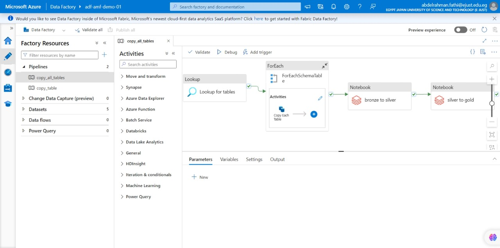
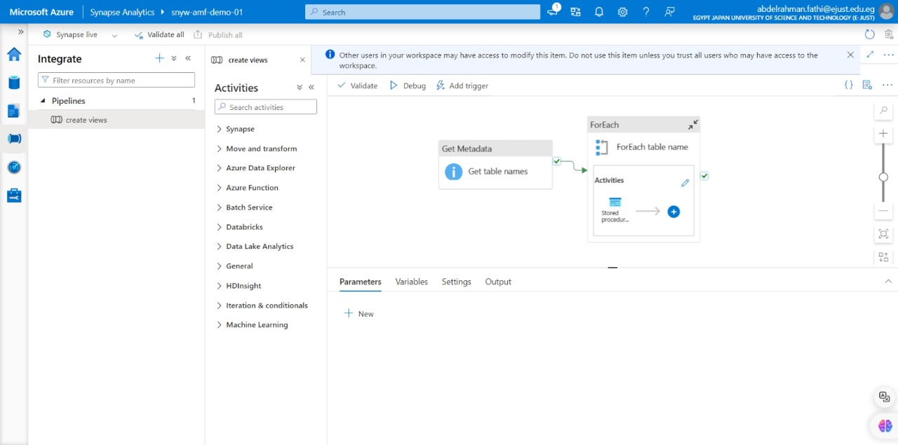
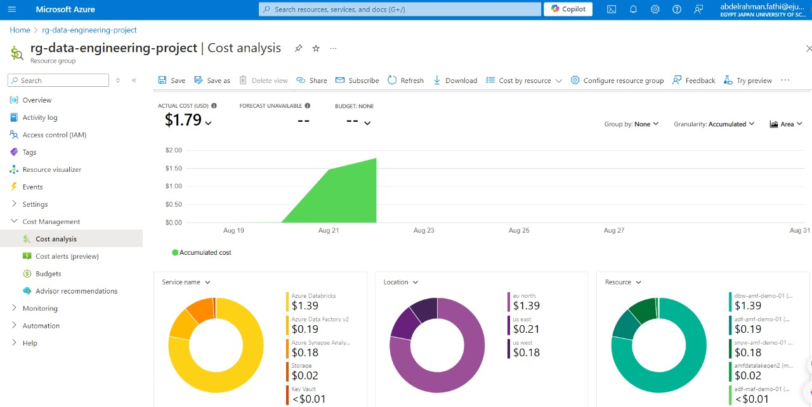

# End-to-End Azure Data Engineering Pipeline

## Overview

This repository showcases a comprehensive end-to-end data engineering solution built on Azure. The project integrates and utilizes various Azure services to orchestrate, transform, and visualize data. The pipeline includes Azure Data Factory (ADF) for orchestration, Azure Databricks for data transformation using PySpark notebooks, Azure Synapse Analytics for data warehousing, and Power BI for visualization.

## Project Structure

The project is organized into the following components:

- **Key Vault**: used to manage secrets. Key Vault eliminates the need for developers to store security information in their code.
- **Azure storage Account**: scalable, durable cloud storage, backup, and recovery solutions for any data, big or small.
- **Azure Data Factory (ADF)**: For data orchestration, workflow automation, and running Databricks notebooks.
- **Azure Databricks**: For data processing, including bronze-to-silver and silver-to-gold transformations using Python notebooks.
- **Azure Synapse Analytics**: For data warehousing and integration.
- **Power BI**: For data visualization and interactive reporting.

## Prerequisites

To set up the project, ensure you have:

- An Azure subscription with permissions to access Azure Data Factory, Databricks, Synapse Analytics, and Power BI.
- Basic understanding of Azure services and data engineering concepts.

## Key Steps

### 1. Download and Restore AdventureWorksLT2017 Database

1. **Purpose**: The AdventureWorksLT2017 database is a sample dataset used to feed data into the pipeline. This database provides a real-world dataset that includes tables such as sales, customers, products, etc.

2. **Steps**:Download the AdventureWorksLT2017 database from [this link](https://learn.microsoft.com/en-us/sql/samples/adventureworks-install-configure?view=sql-server-ver16&tabs=ssms).

### 2. Azure Data Factory (ADF) Setup

Azure Data Factory (ADF) orchestrates data movement and workflow automation, including running Databricks notebooks for data transformations.

0. **Key Actions**:

1. **Create Pipelines**:
   - In ADF, create a pipeline that coordinates the flow of data from raw sources (like the restored SQL database) to Azure Databricks for transformation.

2. **Linked Services**:
   - Set up connections to different data sources like Azure SQL Database, Blob Storage, and Databricks through linked services.

3. **Data Transformation**:
   - Use ADF to trigger Databricks notebooks for data transformation. These notebooks handle the extraction of raw data (bronze), intermediate data cleaning (silver), and final data ready for reporting (gold).
       

### 3. Azure Databricks Setup

Databricks provides the environment for data processing and transformation using Apache Spark. This step transforms raw data into usable formats through different stages (bronze, silver, gold).

0. **Key Actions**:

1. **Create DataBriks**:
   - Create a Databricks Workspace: Set up a workspace in Azure where you can develop and manage notebooks for data transformation.

2. **Configure Clusters**:
   - Spin up a Spark cluster in Databricks to execute the data processing tasks. Choose appropriate cluster sizes depending on the volume of data.

3. **Develop Notebooks**:
   - Write and execute notebooks that handle
   - Bronze
   - Silver
   - Gold
       

### 4 . Azure Synapse Analytics Setup

Synapse Analytics acts as the data warehouse, where transformed data is stored for querying and reporting. This is especially useful for running large-scale SQL queries on structured data.

**Key Actions:**:
   - **Create Synapse Workspace**:
     - Set up a Synapse workspace and connect it to the data storage account to store the output of Databricks transformations.
   - **Create SQL Pools:**:
     - Use either serverless or dedicated SQL pools to manage data storage and querying needs. SQL pools provide scalable compute resources for large query operations.
   - **Run SQL Queries**:
     - Run queries against the processed data for analysis, or set up views to simplify reporting tasks in Power BI.

### 5 . Power BI

Power BI allows you to create interactive reports and dashboards based on the processed data from Synapse. It provides business users with an easy way to explore data and derive insights.

**Key Actions:**:
   - **Connect Power BI to Synapse**:
     - Use Power BI Desktop to connect to the Synapse Analytics workspace and import the necessary data for reporting.
   - **Create Visualizations**:
     - Design custom reports with various data visualizations (e.g., charts, graphs) to summarize and display the transformed data.
   - **Publish and Share Reports**:
     - After creating the reports, publish them to the Power BI service so that stakeholders can view and interact with the data.

### 6 . Cost Analysis
The attached screen represents the cost analysis for the resource group rg-data-engineering-project on Azure. It shows accumulated costs for the services used between August 19 and August 23, amounting to $1.79 USD.
   - **Break Down**:
     - Azure Databricks: $1.39
     - Azure Data Factory v2: $0.19
     - Azure Synapse Analytics: $0.18
     - Storage: $0.02
     - Key Vault: < $0.01
   - **Service usage by location**:
     - EU North: $1.39 (Azure Databricks usage)
     - US East: $0.21
     - US West: $0.19

## Conclusion

This project outlines a comprehensive Azure-based data engineering pipeline that integrates ADF, Databricks, Synapse, and Power BI. The pipeline handles data orchestration, transformation, storage, and visualization, providing a scalable solution for end-to-end data engineering needs.

## Additional Resources

- [Azure Data Factory Documentation](https://learn.microsoft.com/en-us/azure/data-factory/)
- [Azure Databricks Documentation](https://learn.microsoft.com/en-us/azure/databricks/)
- [Azure Synapse Analytics Documentation](https://learn.microsoft.com/en-us/azure/synapse-analytics/)
- [Power BI Documentation](https://learn.microsoft.com/en-us/power-bi/)
